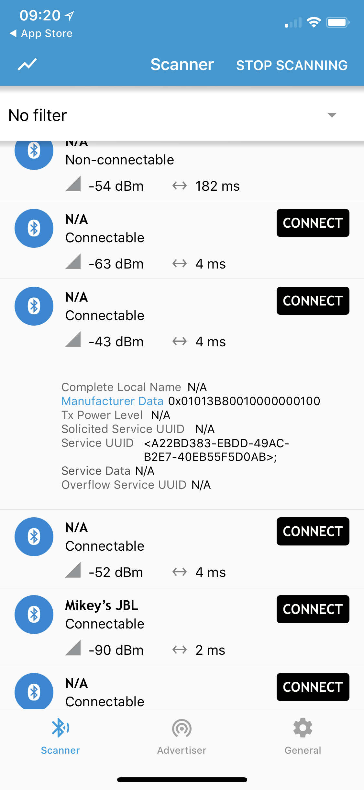
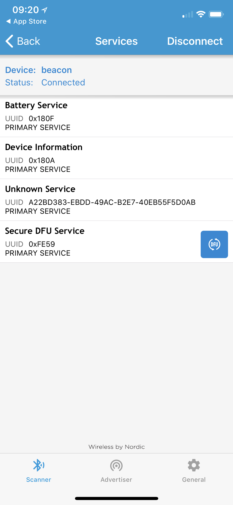
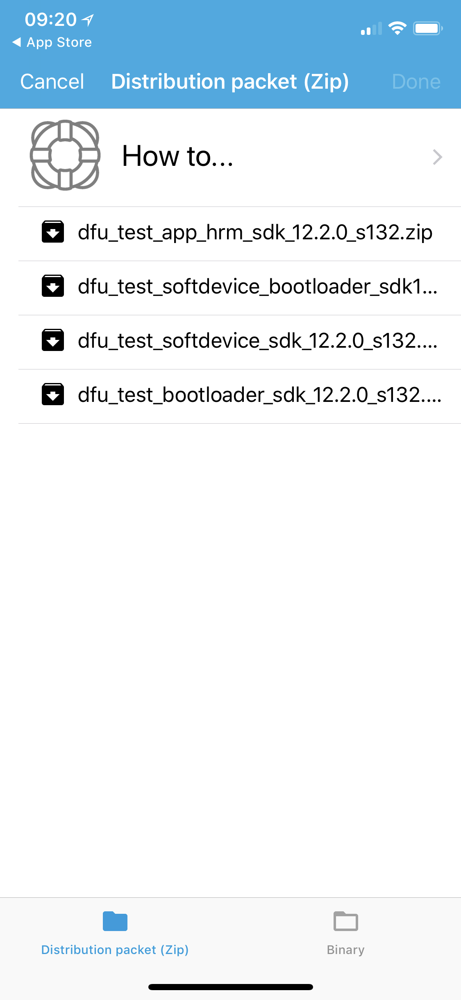
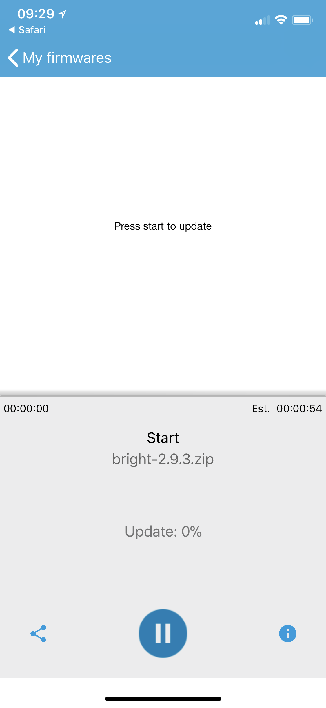
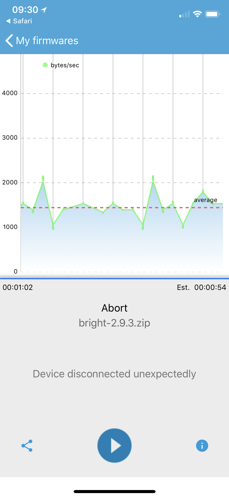
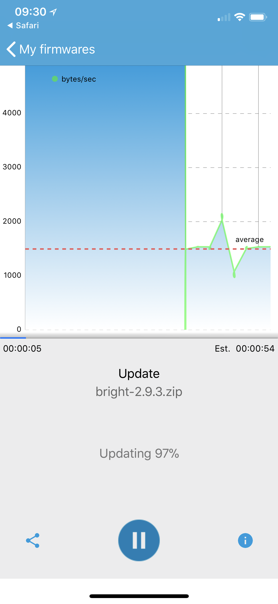

Firmwares for switchmate
========================

Here are a acrhive of every firmware ever released to Switchmate light (wider and older version) and Switchmate bright (thinner and newer version). The reason that someone might want these firmwares is because every Switchmate update breaks backward compability and makes many tools we created for it obselete.

# WARNING

*Update 2018-07-24*: Downgrade using this method may permanently brick your device. The latest version of the firmware remove the auth section and it should be compatible with most of the libraries out there. Please think twice before you downgrade your firmware. For more details see the discussions in: [brianpeiris/switchmate#6](https://github.com/brianpeiris/switchmate/issues/6).

# How to upload the firmware?

## iOS

1. First download [nRF Connect](https://itunes.apple.com/us/app/nrf-connect/id1054362403) from App Store.

2. Open this repository and select the firmware you would to download. Open it the `*.zip` file with nRF Connect.

2. Open the app and find the cooresponding BLE device. It is recommended to bring your Switchmate *really* close to your iOS device so that you can find the device simply by the signal strenth.

  

3. In the Services page, you should be able to find a "Secure DFU Service". Tap the icon on the right to upload a firmware.

  

4. Then you will be prompted to select the firmware package. Click on the "+" sign and simply select the one that you have just downloaded.

  

5. You will return to the firmware page where your just downloaded firmware is listed as below. Tap on the firmware package to start upload.

  

6. Because of the connection time limit, your first upload will always fail at a certain point. Just repeat 2-5 step and you will be able to continue the upload

  

7. In my experience, it will success the second time. Your Switchmate will automatically reboot and you will be ready to use whatever you want with your Switchmate :)

  

## Android (Comming Soon)

It should be pretty much the same process. I'm too lazy to makes those screenshots. Pull request is welcome.

# Some handy packages and their supported firmware

I have not tested every one of the firmwares. Correct me if I'm wrong.

| Package/Device | Version of firmware |
| ------------- | ------------- |
| [Wink Hub 2](https://www.wink.com/products/wink-hub-2/) | Bright (<=1.46), Light (I'm not sure) |
| [node-switchmate](https://github.com/emmcc/node-switchmate) | Bright (<=2.9.3), Light (I'm not sure) |
| [homebridge-switchmate3](https://github.com/valkjsaaa/homebridge-switchmate3) | Bright (=2.9.3), Light (I'm not sure) |
| [switchmate (Python CLI)](https://github.com/brianpeiris/switchmate) | Bright (<=1.46), Light (I'm not sure) |
